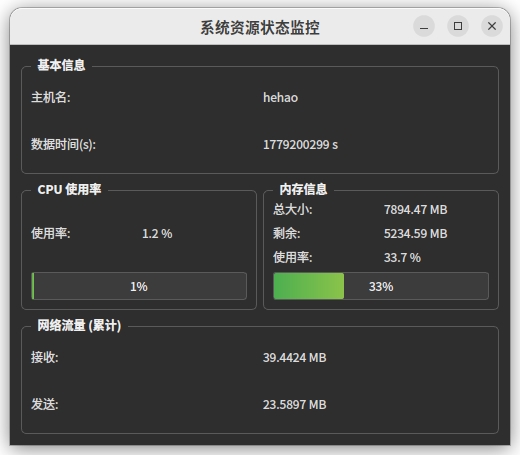

# SystemStatusTool

基于 ROS2 和 Qt5 的实时系统监控工具，通过自定义 ROS2 消息采集并可视化主机 CPU、内存、网络等关键运行状态。



## 功能特性

- 实时采集：独立 ROS2 节点定期读取 `/proc/stat`、`/proc/meminfo`、`/proc/net/dev` 等系统文件，发布状态消息
- 自定义消息：`SystemStatus.msg` 包含时间戳、主机名、CPU/内存使用率、内存总量/可用、网络收发累计字节数
- Qt 图形界面：订阅状态消息，动态显示数值、进度条，支持深色主题，UI 更新在主线程中安全执行
- 非侵入式：基于 ROS2 话题通信，不影响被监控系统的原有逻辑
- 低延迟：采集频率可调（默认 20 Hz），端到端延迟 < 50 ms

## 消息定义

`msg/SystemStatus.msg`

```msg
builtin_interfaces/Time timestamp
string host_name
float32 cpu_percent
float32 memory_percent
float32 memory_total      # 单位 MB
float32 memory_available  # 单位 MB
float64 net_sent          # 累计发送字节数
float64 net_recv          # 累计接收字节数

## 系统架构
[status_publisher 节点]  --publish-->  /sys_status  topic  --subscribe-->  [status_gui 节点 (Qt)]
       |                                                               |
       +-- 采集系统指标                                              +-- 实时显示数值/进度条
## 依赖
Ubuntu 22.04

ROS2 Humble

Qt5 (>= 5.12)

colcon, cmake, g++

bash
sudo apt update && sudo apt install ros-humble-desktop
sudo apt install qt5-default qtbase5-dev

##编译与运行
1. 创建工作空间
bash
mkdir -p ~/ros2_ws/src
cd ~/ros2_ws/src
2. 克隆仓库
bash
git clone https://github.com/hehao3230/SystemStatusTool.git
3. 编译
bash
cd ~/ros2_ws
colcon build --packages-select system_status_tool
source install/setup.bash
4. 运行
bash
ros2 launch system_status_tool status_monitor.launch.py
或分别手动启动：

bash
ros2 run system_status_tool status_publisher
ros2 run system_status_tool status_gui
查看话题数据：

bash
ros2 topic echo /sys_status
节点说明
status_publisher
采集系统指标（CPU、内存、网络），以固定频率（例如 20 Hz）发布 SystemStatus 消息到 /sys_status 话题

读取主机名、/proc/stat 计算 CPU 使用率、/proc/meminfo 获取内存信息、/proc/net/dev 获取网络累计流量

status_gui
继承 rclcpp::Node 并内嵌 Qt 主窗口

订阅 /sys_status，通过 QMetaObject::invokeMethod 将 UI 更新投递到 Qt 主线程

显示主机名、时间戳、CPU 使用率（含进度条）、内存总量/剩余/使用率（含进度条）、网络收发累计流量

深色样式，进度条绿色渐变